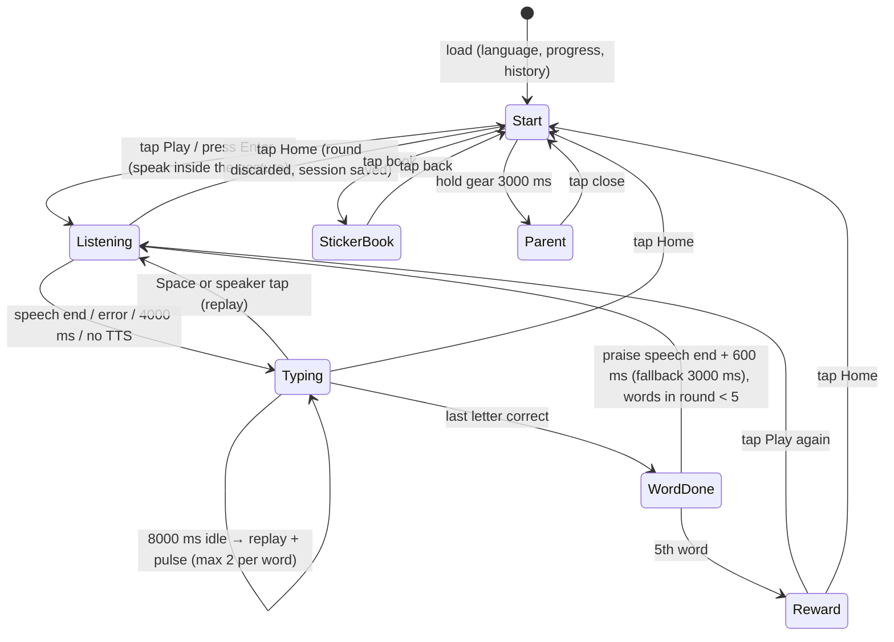

# Letter Leap redesign

Design spec for the SvelteKit 2 + Svelte 5 rewrite. Current behaviour is documented in `okf/`; this document only says what changes. Status: proposal, 2026-10-05.

**Brief.** A child's first keyboard. Children aged 4–7 who cannot read yet hear a word, then find its letters on a real keyboard (laptop) or on big on-screen keys (tablet). A parent sets it up; the child plays alone for 2–10 minutes.

## 1. Design principles

- **Zero reading.** Speech, colour, shape and motion carry every instruction. The only text a child sees is the word being typed.
- **The keycap word is the hero.** Each letter is drawn as a real keycap, and is the same object as the key on the keyboard. Everything else stays quiet.
- **Red hand, blue hand.** Left-hand keys are always red and right-hand keys always blue, on the word and on the mini keyboard. Yellow always means "press this next".
- **Mistakes are hints, not penalties.** A wrong key wobbles and points to the right one. There is no red flash, no buzzer and no score drop shown to the child.
- **Short rounds and a sticker at the end.** Five words make a round, and a round earns a sticker. There is no timer, WPM or percentage on the child's screen.
- **The parent area is behind a gate.** Numbers, history and settings live there.

## 2. Visual system

| Token | Hex | Role |
|---|---|---|
| Paper | `#FFFFFF` | background |
| Ink | `#000000` | 4 px outlines, letters |
| Red | `#E2352B` | left-hand keys |
| Blue | `#1D5FB0` | right-hand keys |
| Sun | `#F6C21A` | next key, rewards |
| Leaf | `#2F8F4E` | typed (done) letters |

The palette is flat primaries with thick black outlines, inspired by Dutch picture books. There are no gradients, no shadows other than a 4 px solid ink offset under keycaps (a "physical key" look), and no rounded-card kit.

- **Type:** Andika only (SIL OFL, designed for beginning readers; single-storey *a* and *g*). Install it with `@fontsource/andika`. Keycap letters render at `clamp(3rem, 14vw, 9rem)`, and mini-keyboard letters at `1.5rem`.
- **Contrast:** white letters on red and blue, ink letters on sun and white, white letters on leaf. Every key also shows its letter, so colour is never the only signal.
- **Motion:** only in response to the child, plus one orchestrated moment (the sticker reveal). With `prefers-reduced-motion`, every movement becomes a 150 ms colour or opacity change, and confetti is off.

## 3. Decisions

1. **Core loop: hear, then see, then type.**
   - While the word is spoken, the keycaps show as **blank caps**. Their count shows the word's length, and their red/blue colour shows the hands.
   - When speech ends, the letters pop in (fallback: 4000 ms).
   - Replay is a big speaker button under the word, or **Space**.
   - After 8 s idle while typing, the word is replayed once and the next key pulses. This repeats at most twice per word.
   - This keeps the earlier "hide while speaking" choice, but no longer shows a blank "..." box.
2. **Feedback**
   - **Correct letter:** the keycap presses down (translateY 4 px, shadow gone) and turns leaf green, and a soft synthesized "tok" plays (WebAudio, no asset files).
   - **Wrong letter:** the target keycap wobbles once (±6°, 300 ms) and the matching mini-keyboard key pulses sun yellow. On the **second** miss of the same letter, the letter name is spoken ("C", or "cee" in English and "see" in Dutch, as the TTS voice says it).
   - **Finished word:** all caps bounce in sequence (60 ms stagger), the word is spoken again, then a short praise phrase in the chosen language, and a star flies into the round dots.
   - **Confetti** only on the sticker reveal.
   - Vibration is dropped (Android-only, and silent everywhere else).
3. **Guidance**
   - An always-visible mini QWERTY keyboard: the left half red, the right half blue, the next key sun yellow with a thick ink ring.
   - No finger diagram. Finger placement is beyond ages 4–7, and the hand colour is enough.
   - No phonics. TTS phoneme output is unreliable; letter names on the second miss only.
4. **Progression**
   - Five word tiers (§7), with a shuffle bag inside each tier: no repeats until the tier is exhausted, and never the same word twice in a row.
   - After each round, if **≤ 3** wrong presses → tier +1 (max 5); if **≥ 10** → tier −1 (min 1); otherwise stay.
   - The parent can pin a tier. There is no timer anywhere.
5. **Rewards**
   - Each completed round grants one sticker: a random pick from 30 animal and object emoji, preferring ones not yet owned.
   - Stickers persist in a sticker book that the child opens from the start screen.
   - No levelling character. It adds an asset pipeline for little gain; revisit if stickers stop motivating.
6. **Parent area**
   - A small gear icon in the corner. **Hold for 3 s** (a ring fills while held) to open it. A tap does nothing.
   - It contains: language, tier (auto or pinned 1–5), sound on/off, the history table, and reset stickers.
7. **Language**
   - The start screen shows two round flag buttons: NL and GB.
   - Tapping one speaks its name in that language ("Nederlands" / "English") and selects it.
   - Praise and letter names are spoken in the chosen language. The parent area is bilingual by default; its labels follow the chosen language.
8. **Information architecture**
   - Drop the one-game hub; `/` is the game.
   - No redirect for the old `/games/letter-leap` URL: the site moved from Firebase to GitHub Pages, so old bookmarks point at a different host anyway.
   - Add a hub back if a second game ever ships.

## 4. State machine



The parent area is an overlay, not a game phase. Opening it from Start only means a game is never paused mid-word.

| Trigger | Delay | Effect |
|---|---|---|
| Listening starts | 4000 ms | force reveal if speech never ends |
| Correct key | 150 ms | key press-down animation; state already advanced |
| Wrong key | 300 ms | wobble; letter-name speech on 2nd miss of the same letter |
| Idle in Typing | 8000 ms | replay word and pulse next key; counter resets on any key; max 2 per word |
| WordDone | speech end + 600 ms, fallback 3000 ms | next word (Listening) or Reward |
| Reward | 0 ms | sticker flip (800 ms), confetti (1500 ms, off under reduced motion); then waits for a tap |
| Gear held | 3000 ms | open parent overlay; releasing early cancels it |

Leaving any phase clears that phase's timers (one `AbortController` or timer set per phase).

## 5. Screens

### Child: start

```
┌──────────────────────────────────────────────┐
│                                         ⚙    │ hold 3 s → parent
│                                              │
│            ┌────┐ ┌────┐ ┌────┐              │
│            │ ▶  │ │    │ │    │  big Play keycap (sun)
│            └────┘ └────┘ └────┘              │
│                                              │
│              (🇳🇱)      (🇬🇧)                 │ selected flag has ink ring
│                                              │
│                    📒 12                      │ sticker book + count
└──────────────────────────────────────────────┘
```

- **Spoken:** nothing on load (browsers block it). Tapping a flag speaks the language name.
- **Animates:** the Play key bobs gently, once every 4 s (the only idle motion in the app; off under reduced motion).
- **Input:** tap Play, or Enter/Space → Listening. Tap a flag. Tap the book. Hold the gear.

### Child: play (listening → typing)

```
┌──────────────────────────────────────────────┐
│ ⌂                         ● ● ○ ○ ○     ⚙   │ home · round dots
│                                              │
│        ┌────┐ ┌────┐ ┌────┐                  │
│        │ C  │ │ A  │ │ T  │   red · red · red (all left hand)
│        └────┘ └────┘ └────┘   next cap: sun ring
│                                              │
│                  (( 🔊 ))                     │ replay
│                                              │
│  ┌────────────────────────────────────────┐  │
│  │ Q W E R T │ Y U I O P                  │  │ red | blue
│  │  A S D F G │ H J K L                   │  │ next key: sun + ring
│  │   Z X C V B │ N M                      │  │ tappable on touch
│  └────────────────────────────────────────┘  │
└──────────────────────────────────────────────┘
```

- **Spoken:** the word (lowercase, rate 0.8, pitch 1.2, voice picked explicitly, as now). On replay or idle: the word again. On the 2nd miss of a letter: the letter name.
- **Animates:**
  - Listening: the caps are blank, and the speaker icon shows sound rings.
  - Reveal: letters pop in (scale 0.6 → 1, 200 ms, 40 ms stagger).
  - Correct key: press-down and turns leaf. Wrong key: wobble plus the target pulses.
- **Input:**
  - Physical A–Z, through capture-phase keydown with `preventDefault`, as now.
  - Space = replay.
  - On touch devices, the mini keyboard keys are buttons of at least 56 px. The hidden-input hack is removed: no OS keyboard, no autocorrect, no double counting.
  - Home = end session.

### Child: word done

The play screen with all caps leaf green. A star flies from the word into the next round dot.

- **Spoken:** the word, then praise. EN: "Great job!", "Yes!", "Well done!", "Super!". NL: "Goed zo!", "Ja!", "Knap!", "Super!", "Top!".
- **Input:** keys are ignored.

### Child: reward (end of round)

```
┌──────────────────────────────────────────────┐
│ ⌂                         ★ ★ ★ ★ ★     ⚙   │
│                                              │
│                 ┌────────┐                   │
│                 │   🦒   │  sticker flips in  │
│                 └────────┘                   │
│                                              │
│          ┌────┐            ┌────┐            │
│          │ ▶  │            │ ⌂  │            │ again · home
│          └────┘            └────┘            │
└──────────────────────────────────────────────┘
```

- **Spoken:** praise, plus the sticker name if the emoji maps to a word in the list ("giraffe" / "giraf").
- **Animates:** the one orchestrated moment: the five stars converge, then the sticker flips (800 ms), then confetti (1500 ms). Under reduced motion, it's a fade only.
- **Input:** Play/Enter → next round (speak inside the gesture). Home → Start. The tier is re-evaluated before the next round.

### Child: end (Home pressed)

There's no separate screen; the child returns to Start. The session is saved silently, and the sticker book count bumps with a single pop if a sticker was earned.

### Child: sticker book

Grid of owned stickers on paper; unowned ones are faint ink outlines. Tapping a sticker speaks its name. A back keycap returns to Start.

### Parent: settings (overlay)

```
┌──────────────────────────────────────────────┐
│ Settings                                  ✕  │
│ Language      (•) Nederlands  ( ) English    │
│ Word level    (•) Automatic   ( ) 1 2 3 4 5  │
│ Sound effects [on]                           │
│ Stickers      12 collected     [Reset]       │
│ ─────────────────────────────────────────────│
│ History                                      │
│ Today 14:02   7 min  15 words  level 2  91%  │
│ Yesterday …                                  │
└──────────────────────────────────────────────┘
```

- **Spoken:** nothing.
- **Input:** mouse/touch/keyboard. Esc closes. Focus is trapped while open; uses a native `<dialog>`.
- **History** is the existing `SessionStats` list: the newest 10, with a date via `Intl.RelativeTimeFormat`, duration, words, tier, and accuracy %. WPM is kept in the data, but hidden by default because it means nothing at this age.

## 6. Data model diff (vs `okf/concepts/game-state.md`)

```diff
- interface GameState extends PerformanceData {
-   currentWord, currentWordIndex, typedWordPortion,
-   isPlaying, isSessionOver, showStartScreen,
-   feedback, feedbackLetter, currentLevel,
-   showPraiseMessage, praiseText, praiseIcon, activeHand,
-   currentWPM, currentAccuracy, ...
- }
+ type Phase = 'start' | 'listening' | 'typing' | 'wordDone' | 'reward' | 'stickers';
+ interface Game {
+   phase: Phase;
+   word: string | null;          // UPPERCASE
+   index: number;                // next letter
+   missesOnLetter: number;       // resets per letter; 2 → speak letter name
+   idleReplays: number;          // 0..2 per word
+   lastPress: { ok: boolean; at: number } | null;   // drives one-shot animations
+   round: { words: number; misses: number };        // 0..5 words
+   session: { startedAt: number; correct: number; total: number;
+              words: number; streak: number; longestStreak: number; rounds: number };
+ }
+ // derived, not stored: hand(letter), nextKey, accuracy, wpm
```

```diff
  interface SessionStats {
    id, date, accuracy, wpm, lettersTyped, wordsTyped, durationMinutes, longestStreak
+   tier?: number;        // tier at session end
+   language?: Language;
+   stickers?: number;    // earned this session
  }
```

**Storage**

| Key | Change |
|---|---|
| `letterLeapSessions` | Unchanged format. New fields are optional, so old records render as-is (with "–" for missing tier/language). Still the newest 10. |
| `letterLeapLanguage` | Unchanged (`"en"` / `"nl"`). |
| `letterLeapProgress` *(new)* | `{ v: 1, tier: 1..5, tierMode: 'auto' \| 'pinned', stickers: string[], sound: boolean }` |

Migration: if `letterLeapProgress` is missing, create it with `{ v: 1, tier: 1, tierMode: 'auto', stickers: [], sound: true }`. If it is unparsable or `v` is unknown, reset only this key, never the history. Old sessions are not converted.

## 7. Word lists

The tiers are chosen by which letters a word uses and how long it is. All words stay A–Z only.

| Tier | Rule | EN examples | NL examples |
|---|---|---|---|
| 1 | 2–4 letters, home row only (`ASDFG HJKL`) | DAD, SAD, ASK, ADD, HAS, ALL, GAS, FLAG | JAS, DAK, DAG, HAL, GAS, LAS, ALS, KAAS |
| 2 | 2–3 letters, any keys | CAT, DOG, SUN, PIG, HEN, UP, BOX, CUP | KAT, VIS, KIP, ZON, BAL, AAP, UIL, KOE |
| 3 | 4 letters | BALL, TREE, FISH, MOON, FROG, KITE | HOND, BOOM, HUIS, MAAN, BEER, MUIS |
| 4 | 5–6 letters | APPLE, TIGER, ZEBRA, MONKEY, RABBIT | PAARD, TAFEL, KONIJN, BANAAN, LEEUW |
| 5 | 7+ letters | ELEPHANT, PENGUIN, DOLPHIN, CROCODILE | OLIFANT, VLINDER, SCHILDPAD, SPRINGEN |

- Tiers are **computed** from one flat list per language by a pure `tierOf(word)` function, so adding a word never needs a tier label.
- The existing 90 words per language are kept. Tier 1 needs about 15 new home-row words per language (the current lists have almost none).
- Tier 1 teaches where the hands rest; tier 2 starts reaching for other keys.
- **Picking:** a shuffle bag per tier; when it empties, refill and reshuffle, and never draw the previous word first.
- **Sticker names:** stickers map to list words where possible (🐱 CAT/KAT, 🦒 GIRAFFE/GIRAF), so the reward reinforces vocabulary.

## 8. Cut / keep

**Cut**
- Game Hub page: there's only one game, so it's an extra click for a child.
- WPM/accuracy/streak/level stat cards on the child screen: unreadable for the audience, and they put pressure on the child.
- Session-end toast with numbers: unreadable; replaced by the reward screen.
- Text praise bubble: replaced by spoken praise plus stars.
- `currentLevel`, the `'timeout'` feedback, `LEVEL_*`/`ALPHABET` constants: dead code.
- The hidden mobile input: replaced by a tappable on-screen keyboard (it fixes double counting and autocorrect).
- `navigator.vibrate`: Android-only, invisible elsewhere.
- Soft-blue SaaS theme, Geist font: generic, and not designed for early readers.
- genkit, firebase SDK, react-query, recharts, zod, react-hook-form, unused shadcn components: unused.
- Dark palette: nothing toggles it.

**Keep**
- `speakWord` workarounds (gesture start, explicit voice, cancel-if-busy, 4 s fallback): each fixed a real silent-audio bug.
- Capture-phase keydown with `preventDefault`: blocks browser shortcuts and works with AZERTY via `event.key`.
- The red/blue QWERTY hand split: same data, now drawn on a keyboard.
- Word lists: good vocabulary; they become tiers 2–5.
- `letterLeapSessions`/`letterLeapLanguage` keys: returning players keep their data.
- Static prerendered site + GitHub Actions, now deployed to GitHub Pages instead of Firebase.
- Session history (parent view only): parents want to see progress.

## 9. Risks and open questions

1. **No Dutch TTS voice** on some Windows/Android machines. Decision: detect with `getVoices()` after `voiceschanged`. If there's no `nl` voice, show a struck-out speaker icon and reveal words immediately. Show a parent-area note on how to install one.
2. **Belgian AZERTY keyboards.** Matching uses `event.key`, so typing works, but the mini keyboard is drawn QWERTY. Open question: add a layout toggle in the parent area?
3. **Emoji stickers render differently** per OS (Windows looks very different). Ship SVG stickers later if this matters.
4. **iPad with a hardware keyboard** gets both input paths, which is fine. With no keyboard it uses the on-screen keys. Phones are too narrow for 56 px keys (10 × 56 > 375 px), so phones are not supported for play; the parent area works.
5. **Second-miss letter names:** some voices say Dutch letter names oddly (e.g. "IJ" doesn't exist as one key). Needs a listening test per voice.
6. **Tier thresholds (≤ 3 / ≥ 10 misses per 5 words) are guesses.** Watch two or three real kids and tune them.
7. **Hide-while-speaking vs. show immediately:** kept as blank caps per the earlier decision. Open question: does seeing the letters while hearing the word help pre-readers more?
8. **Progress per language:** a single shared tier is assumed. Open question: does a bilingual child need separate tiers for EN and NL?

## 10. Svelte structure

```
src/
  app.html
  app.css                         # tokens §2, keyframes, reduced-motion overrides
  routes/
    +layout.ts                    # export const prerender = true
    +layout.svelte                # font, <svelte:head>
    +page.svelte                  # the whole game: switches on game.phase
  lib/
    data/words.ts                 # WORDS_BY_LANGUAGE (verbatim + tier-1 additions), tierOf()
    data/stickers.ts              # emoji → { en, nl } names
    data/praise.ts                # spoken praise per language
    keyboard.ts                   # QWERTY rows, hand(letter)
    speech.ts                     # speakWord, speakLetter, voice pick, hasVoice(lang)
    sfx.ts                        # WebAudio tok/bloop/chime, honours sound setting
    storage.ts                    # sessions, language, progress (+ migration)
    picker.ts                     # shuffle bag per tier
    game.svelte.ts                # createGame(): $state Game, actions, phase timers
    components/
      KeycapWord.svelte           # blank / revealed / done caps, press + wobble
      Keycap.svelte               # one cap: letter, hand colour, state
      MiniKeyboard.svelte         # tappable on touch; highlights next key
      ReplayButton.svelte
      RoundDots.svelte
      PlayKey.svelte
      LanguageFlags.svelte
      RewardScene.svelte          # stars → sticker → confetti
      StickerBook.svelte
      HoldGate.svelte             # 3 s hold ring
      ParentDialog.svelte         # <dialog>: settings + history
```

- **Component tree:** `+page.svelte` → { `Start` (`PlayKey`, `LanguageFlags`, book button, `HoldGate`) | `Play` (`RoundDots`, `KeycapWord` → `Keycap`×n, `ReplayButton`, `MiniKeyboard` → `Keycap`×26) | `RewardScene` | `StickerBook` } + `ParentDialog`.
- `+page.svelte` uses `<svelte:window onkeydowncapture>`.
- The game lives in a single route, so phases are rendered with `{#if}` on `game.phase` rather than separate routes. This avoids losing `$state` on navigation, and speech stays inside gestures.
- Dependencies: `@fontsource/andika`, `@lucide/svelte` (speaker, home, gear, book). No shadcn: the UI is custom keycaps, and the parent dialog is a native `<dialog>`.
- All pitfalls in `okf/architecture/svelte-port.md` still apply.
