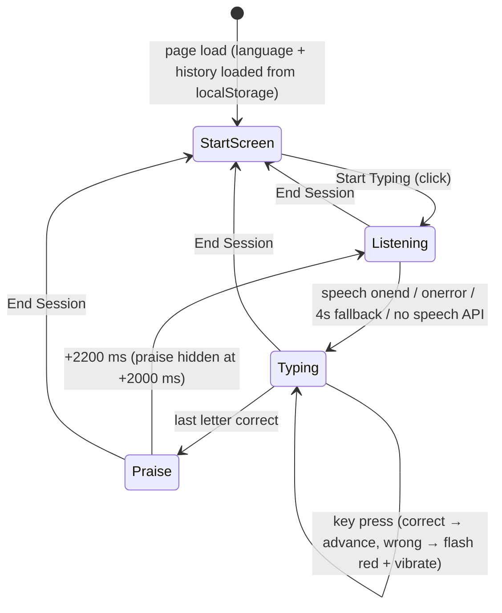

# Summary

One session is an endless sequence of words; there is no time limit. The child presses **Start Typing**, hears a word, sees it appear, types it letter by letter, gets praise, and the next word follows. **End Session** stops the game, saves stats and returns to the start screen. All of this lives in `useLetterLeapGame`, which [defines](/concepts/game-state.md) the state and [depends on](/concepts/speech.md) speech, [keyboard input](/concepts/input-handling.md), [scoring](/concepts/scoring.md), [hand hints](/concepts/hand-hints.md) and [persistence](/concepts/persistence.md).

# Phases



There is no explicit `phase` field. A phase is derived from flags:

| Phase | `showStartScreen` | `isPlaying` | `currentWord` | `wordHidden` | `showPraiseMessage` |
|---|---|---|---|---|---|
| StartScreen | true | false | null | – | false |
| Listening | false | true | set | **true** | false |
| Typing | false | true | set | false | false |
| Praise | false | true | set, fully typed | false | true |

A rewrite should use one explicit `phase` enum instead. That is simpler and makes the illegal combinations impossible.

# Flows in detail

## Mount

1. `synth = window.speechSynthesis`.
2. Read `localStorage["letterLeapLanguage"]`. If it is `'en'` or `'nl'`, use it; otherwise default to `'en'`.
3. `pastSessions = loadSessionStats()`.
4. On unmount, `synth.cancel()`.

## startGame (Start Typing / Play Again click)

1. Reset to `initialGameState`, keeping `currentLevel`. Set `isPlaying = true`, `gameStartTime = Date.now()`, `showStartScreen = false`, `isSessionOver = false`.
2. Focus the hidden input, which opens the mobile keyboard.
3. Call `showNewWord()` **synchronously inside the click handler**. Browsers (Safari especially) block speech that a user gesture did not start; an earlier 150 ms `setTimeout` caused silent first words.

## showNewWord

1. `nextWord` = a uniformly random pick from `WORDS_BY_LANGUAGE[language]`. Repeats are allowed, including the same word twice in a row.
2. `wordHidden = true`, then `speakWord(nextWord, onDone = () => wordHidden = false)`.
3. Set `currentWord = nextWord`, `currentWordIndex = 0`, `typedWordPortion = ""`, clear feedback, `activeHand = hand(nextWord[0])`.
4. Focus the hidden input.

The word box shows "..." while `wordHidden` is true; key presses are ignored. Safety net: if `wordHidden` is still true after **4000 ms**, it is forced false (Chrome sometimes never fires `onend`).

## Key press (`handleKeyPress(key)`)

The input layer accepts a key only when `isPlaying && !isSessionOver && currentWord && !wordHidden` and the character matches `/^[a-zA-Z]$/` (see [Input Handling](/concepts/input-handling.md)).

```
target = currentWord[currentWordIndex]
if key.toUpperCase() == target:
    feedback = 'correct'; correctPresses++; currentStreak++
    longestStreak = max(longestStreak, currentStreak)
    typedWordPortion += target; currentWordIndex++
    activeHand = (index < len) ? hand(currentWord[index]) : null
else:
    feedback = 'incorrect'; currentStreak = 0
    navigator.vibrate?.(100)
    activeHand = hand(target)               # unchanged target
totalPresses++
feedbackLetter = target
if word complete (index == len) and correct:
    wordsTyped++
    show praise = random pick of PRAISE_MESSAGES (text + icon)
else:
    showPraiseMessage = false
recompute WPM / accuracy                   # see Scoring
```

Key presses after the word is complete but before the next word appears are ignored by the guard `currentWordIndex >= currentWord.length`.

## Timers (all cancelled on unmount or when the triggering state changes)

| Trigger | Delay | Effect |
|---|---|---|
| any key press (`feedback` set) | 700 ms | clear `feedback` and `feedbackLetter`; restarts on every press |
| `wordsTyped` increments while playing | 2000 ms | hide praise |
| same | 2200 ms | `showNewWord()` |
| `wordHidden` becomes true | 4000 ms | force `wordHidden = false` |

Ending the session flips `isPlaying` to false, and the effect cleanup cancels the pending praise and next-word timers. Without that cancellation, a word would appear on the start screen.

Note that `showNewWord()` from the 2200 ms timer is **not** inside a user gesture. In practice browsers allow speech once the page has had one user activation (the Start click), so later words speak fine.

## endSession (End Session click)

1. `synth.cancel()`.
2. If not playing, do nothing.
3. Build a `SessionStats` record (see [Scoring](/concepts/scoring.md)), prepend it to `pastSessions`, keep the **newest 10**, and save to localStorage.
4. Toast: title "Session Ended!", description "You typed N words! WPM: W, Accuracy: A%".
5. State: `isPlaying = false`, `isSessionOver = true`, `showStartScreen = true`. Clear the word, hand and praise. **Stats such as streak and WPM are kept** (but not displayed, because the stats grid is only shown when `!showStartScreen`).
6. Blur the hidden input.

The button then reads **"Play Again"** (`isSessionOver`).

## Language switch

Only visible on the start screen. `setLanguage(id)` updates state and `localStorage["letterLeapLanguage"]`. It takes effect for the next word picked.

# Known quirks (decide whether to keep)

* In React dev StrictMode, the toast inside the `setGameState` updater runs twice. This only happens in dev; there is no need to reproduce it.
* `calculateStats` runs twice per key press (directly, and from an effect). This is harmless.
* In one real-browser run, the accuracy after a perfectly typed word showed 83.3%. That means one extra wrong press was counted (cause not confirmed; possibly a key that arrived during the praise-to-next-word transition). Verify this in the rewrite.

# Citations

* `src/hooks/use-letter-leap-game.ts` (whole file).
* `src/app/games/letter-leap/page.tsx`.
