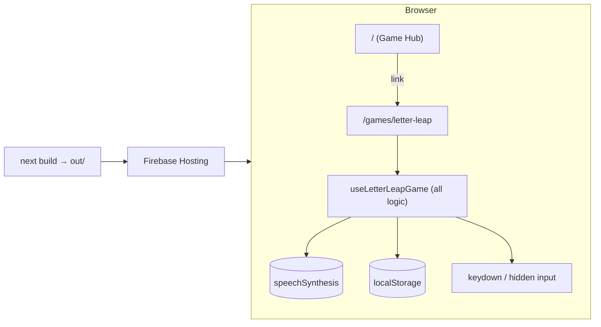
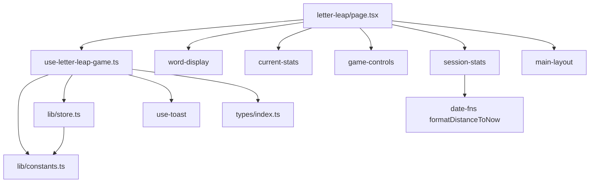

# Runtime model

* **No server logic.** `next.config.js` sets `output: 'export'`, so `next build` emits static HTML/JS into `out/`. Every page is a client component (`"use client"`).
* **Browser APIs used:** `speechSynthesis` (text-to-speech), `localStorage`, `navigator.vibrate`, keyboard and input events.
* **No network calls, no auth, no database.** Firebase is used only as a static host.

# File map (live code only)

| File | Role | Concept |
|---|---|---|
| `src/app/layout.tsx` | Root HTML shell, Geist font, `<Toaster/>` | [UI Routes](/ui/routes.md) |
| `src/app/page.tsx` | Game Hub: one card linking to Letter Leap | [UI Routes](/ui/routes.md) |
| `src/app/games/letter-leap/page.tsx` | Game screen: start card, word, hands, stats, controls, history | [UI Routes](/ui/routes.md) |
| `src/hooks/use-letter-leap-game.ts` | **All game logic**: state, speech, input, timers, scoring, persistence | [Game Loop](/architecture/game-loop.md) |
| `src/lib/constants.ts` | Word lists, languages, praise messages, hand key sets, storage keys | [Words & Languages](/concepts/words-and-languages.md) |
| `src/lib/store.ts` | `loadSessionStats` / `saveSessionStats` (localStorage JSON) | [Persistence](/concepts/persistence.md) |
| `src/types/index.ts` | `GameState`, `SessionStats`, `FeedbackType` | [Game State](/concepts/game-state.md) |
| `src/components/word-display.tsx` | Big word with per-letter styling and feedback flash | [Components](/ui/components.md) |
| `src/components/current-stats.tsx` | 5 live stat cards | [Components](/ui/components.md) |
| `src/components/game-controls.tsx` | Start / Play Again / End Session buttons | [Components](/ui/components.md) |
| `src/components/session-stats.tsx` | Past-sessions table | [Components](/ui/components.md) |
| `src/components/layout/main-layout.tsx` | Header, main, footer | [Components](/ui/components.md) |
| `src/app/globals.css`, `tailwind.config.ts` | Theme tokens and custom animations | [Theme](/ui/theme.md) |
| `src/hooks/use-toast.ts`, `src/components/ui/toast*.tsx` | shadcn toast system (used once, on session end) | [Components](/ui/components.md) |

# Module dependencies

The page is presentational: it reads `gameState` and calls `startGame`, `endSession` and `setLanguage`. The rendering rules are in [UI Routes](/ui/routes.md).

# Dead weight (do not port)

* `src/components/ui/*`: about 30 shadcn components are generated, but only `card`, `button`, `table`, `scroll-area`, `toast` and `toaster` are used.
* `src/hooks/use-mobile.tsx`: unused.
* Constants `ALPHABET`, `MAX_LEVEL`, `MIN_LEVEL` and `LEVEL_TO_INTERVAL_MS`: unused. `currentLevel` is always 1 (shown in the "Level" card, never changes).
* `FeedbackType` value `'timeout'`: never produced.
* `.can-proceed-pulse` CSS: leftover from the removed Addition game.
* Dependencies `genkit`, `@genkit-ai/googleai`, `genkit-cli`, `firebase`, `@tanstack/*`, `react-hook-form`, `zod`, `recharts`, `patch-package` and others: unused at runtime. The `genkit:*` scripts point at `src/ai/dev.ts`, which does not exist. See [Build & Deploy](/config/build-and-deploy.md).
* `docs/blueprint.md` describes an original "random letters + AI adaptive speed" design that was never implemented.

# Citations

* `next.config.js`, `package.json`, `src/**` at git HEAD `9bd68d7` plus working tree, 2026-10-05.
